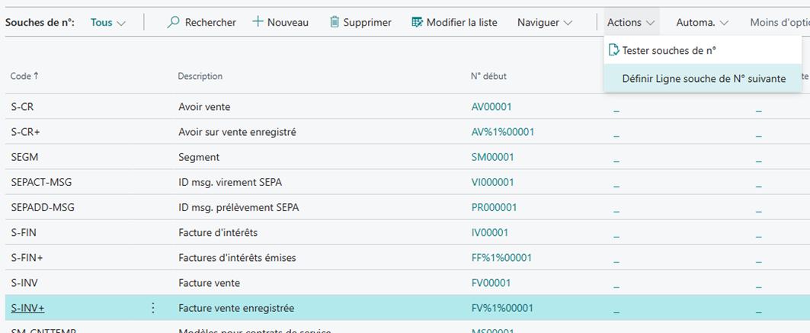
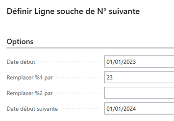
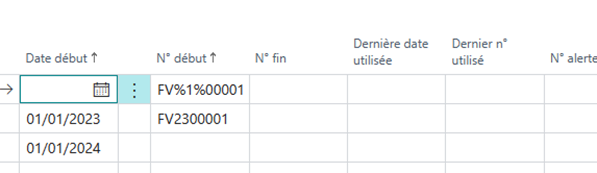
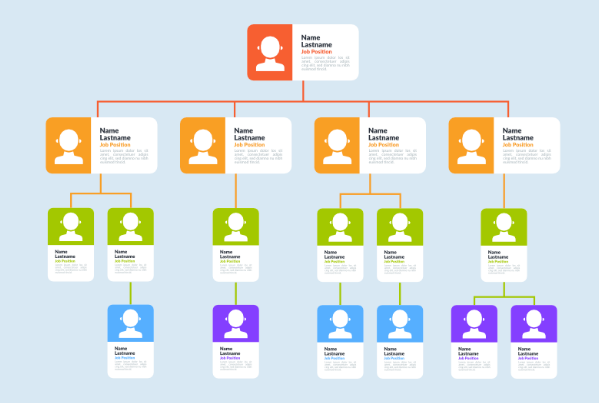
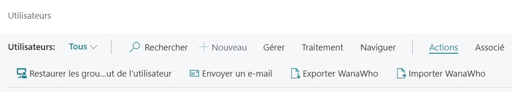

# Extension WanaMisc

Cette extension regroupe des fonctions qui ne justifient pas une extension à elles seules (*Miscellaneous* signifiant Divers 😉 ).

Elles ont en commun d’être indépendantes les unes des autres et de n’avoir aucun impact sur le schéma des tables standards.

**Sommaire**
- [Souches de N°](#souches-de-n)
- [Contrôle imputation directe](#contrôle-imputation-directe)
- [Balance salariés](#balance-salariés)
- [Livraison à soi-même](#livraison-à-soi-même)
- [Articles et stocks](#articles-et-stocks)
- [Administration](#administration)
  - [Objets et autorisations](#objets-et-autorisations)
- [Import des personnes (WanaWho)](#import-des-personnes-wanawho)
  - [Utilisateurs](#utilisateurs)

## Souches de N°
Lorsque les N° sont attribués à l’aide d’une souche de N° ‘datée’ (dont la **Date début** des **Ligne souche de N°** est renseignée), il faut, à chaque changement de date (généralement par exercice) définir une nouvelle ligne.

La fonction ci-après facilitera cette opération fastidieuse.

Pour celles-ci, une **Ligne souche de N°** initiale est définie sans **Date début** et permet de définir une partie variable par ‘%1%’ et/ou ‘%2%’ (ex : FV%1%00001).

L’action **Définir souche de N° suivante** permet alors de remplacer ces parties variables par les éléments souhaités pour toutes les souches ainsi définies (ex : FV2300001 au 01/01/2023) :

De plus, une **Ligne souche de N°** est créée pour la période suivante, mais sans **N° début** :

Cette dernière évitera ainsi de poursuivre l’attribution basée sur la souche au 01/01/2023, appelant par là à **Définir Ligne souche de N° suivante** pour la prochaine période.

## Contrôle imputation directe
Pour limiter les risques d’incohérence et faciliter les analyses, les comptes associés aux groupes de comptabilisation ne seront généralement pas imputable directement (**Imputation directe** non coché).

Cela semble évident pour le compte 411 associé au **Groupe compta client** qui ne sera imputé qu’au travers d’un compte client et le compte 401 mouvementé au travers d’un compte fournisseur.

Il en est de même pour les comptes financiers auxiliarisés par **Compte bancaire** ou aux comptes auxiliarisés par salarié le cas échéant (pour permettre le lettrage).

Ce principe est généralisé par exemple :

* Aux comptes 60 et 70 associés aux **Paramètres comptabilisation** (définis par combinaison des **Groupe compta marché** et **Groupe compta produit**) qui seront mouvementés par la validation des documents d’achats ou de ventes.
* Aux comptes 445 associés aux **Paramètres compta TVA** (définis par combinaison des **Groupe compta marché TVA** et **Groupe compta produit TVA**) qui seront mouvementés via la validation des charges et produits et via le traitement de déclaration de TVA (et lors du lettrage pour la TVA sur encaissements).
* Aux comptes de classe 3 et aux comptes de variation correspondants (603 et 713) mouvementés par le traitement de comptabilisation des stocks (**Valider coûts ajustés**).
* Aux comptes associés aux immobilisations (20, 21 pour la valeur d’acquisition et 280 et 281 pour les amortissements voire 290 et 291 pour les dépréciations), mais les comptes de dotation (68) doivent cependant rester en **Imputation directe**.

L’état de contrôle imputation directe recense les comptes qui dérogent à ce principe et permet de désactiver **Imputation directe** si nécessaire.

## Balance salariés
Contrairement aux comptes clients ou fournisseurs, Business Central ne propose pas de balance auxiliaire pour les comptes salariés.

L’extension WanaMisc vient combler cette lacune et propose un état similaire à la balance fournisseur.

## Livraison à soi-même
Voir article dédié à ce sujet : [Comment être soi-même ?](https://www.wanamics.fr/comment-etre-soimeme/)

Comme indiqué dans l’article, les **Paramètres comptabilisation** permettent de définir un unique **Compte remise fact. vente**.

Depuis la combinaison du **Groupe compta marché** défini pour la livraison à soi-même et chacun des **Groupe compta produit**, l’action **Compte rem. fact. par catégorie article** permet de définir un compte spécifique à chacune des catégories.

Celui-ci est alors pris en compte en lieu et place de celui défini en **Paramètres comptabilisation** qui n’est pris que par défaut.

De plus, un **N° client livraison à soi-même** peut être défini en **Paramètres ventes** (à ajouter via **Personnaliser** le cas échéant).

Dès lors, le **Prix unitaire** d’une ligne de document de vente relative à ce **N° client facturé** reprendra le **Coût unitaire** de cette même ligne (coût de transfert).

## Articles et stocks
Depuis la liste des **Ecritures comptables article** le **N° document** est cliquable pour afficher le document concerné (plus simple et plus rapide que **Rechercher des écritures** puis sélection de la table associée).

## Administration
### Objets et autorisations
Lorsqu’un utilisateur vous signale qu’il rencontre une erreur ‘Vous n’avez pas l’autorisation…’ le message vous indique l’objet concerné.

Reste à savoir dans quel(s) ensemble(s) d’autorisations il est présent pour le lui ajouter.

Recherchez **Tous les objets avec libellé**.
Sélectionnez l’objet souhaité puis l’action **Ensembles d’autorisation**.

## Import des personnes (WanaWho)
Une même personne peut être définie comme :

* Utilisateur de Business Central avec
  * ses autorisations, 
  * son profil,
  * ses **Paramètres utilisateur**)
* Vendeur/acheteur
* Salarié
* Ressource

Cette fonction n’a d’autre ambition que de faciliter la mise à jour des informations relatives à une même personne dans ces différentes entités, via une feuille Excel.

### Utilisateurs
Les actions suivantes sont ajoutées à la liste des utilisateurs :

|||
|---|---|
|Export|	Créé un classeur Excel (une feuille reprenant le nom de la société au format attendu par l’import) reprenant les utilisateurs sélectionnés et les informations associées.|
|Import|	Créé ou met à jour les données concernées à partir de la feuille correspondant au nom de la société.|

**Relations entre les tables**

Les données ci-après sont liées de façon indirecte à l’utilisateur :

| |	Lié à|	par|
|--------|----|----|
|Vendeur/Acheteur|	Paramètres utilisateur	|Code vendeur/acheteur|
|Salarié	|Vendeur/acheteur	|Code vendeur/acheteur|
|Ressource	|Salarié	|N° ressource|
|Ressource (à défaut)|	Utilisateur|	Code utilisateur du propriétaire de la feuille de temps|

**Remarques**
* L’utilisateur sert de référence. Il n’est donc pas possible de mettre à jour des données (vendeur/acheteur, Salarié, Ressource) pour un utilisateur non défini. En revanche, il est possible de définir un utilisateur inactif et/ou sans licence.
* Il faut impérativement préserver l’ordre des colonnes.
* Les titres des colonnes mentionnent le nom du champ, et après un saut de ligne, le nom de la table concernée entre parenthèses. Il est recommandé d’augmenter la hauteur de la ligne de titre autant que nécessaire pour voir ces informations.
* Les colonnes sont de type ‘Texte’. Avant d’y mettre formule mais il faudra en modifier le type en ‘Standard’. Ces formules permettront en particulier de rendre la codification homogène.
* Si l’identifiant de la table concerné (en gras dans la liste ci-après) n’est pas renseigné, celle-ci ne sera pas mise à jour (il peut bien sûr être défini par une formule).
* Une codification homogène semble assez naturelle, mais il y a alors risque de confusion quant à l’origine de l’information.
* Les souches de N° ne sont pas utilisées et doivent donc être autorisées en **N° manuel**.
* Pour la version SaaS, les informations de l’utilisateur (colonnes marquée (*)) sont définies par l’action **Mettre à jour les utilisateurs à partir de Microsoft 365**.
* Les règles de validation habituelles s’appliquent. Ainsi par exemple, il n’est pas possible d’attribuer le même code vendeur/acheteur à plusieurs utilisateurs.

**Evolutions envisagées**
* Rechercher un lien par défaut, via e-mail et/ou N° téléphone

**Format**

|Table|	Champ|	Remarques|
|--|--|--|
|Utilisateur	|ID sécurité utilisateur&nbsp;(*)	|A laisser vide pour créer un nouvel utilisateur (préciser alors le **Nom d’utilisateur** dans la colonne suivante).
|Utilisateur	|Nom d’utilisateur&nbsp;(*)	|Il s’agit plus précisément du code de l’utilisateur
|Salarié	|Prénom	| **Prénom** et **Nom usuel** sont concaténés pour former le Nom le cas échéant (Vendeur/acheteur, Ressource).
|Salarié	|Nom usuel	| |
|Utilisateur	|Type licence&nbsp;(*)||	 
|Utilisateur	|Région/État&nbsp;(*)	|| 
|Utilisateur	|E-mail du contact&nbsp;(*)	|Il est repris pour le vendeur/acheteur et le salarié (en **Adresse e-mail société**)|
|Membre du groupe d’utilisateurs	||Code du groupe d’utilisateurs	Seul le premier groupe est pris en compte. Les autres devront être définis via la fiche utilisateur.
|Personnalisation utilisateur	|ID profil	 ||
|Paramètres utilisateur	|ID approbateur	 ||
|Paramètres utilisateur	|Registre temps	 ||
|Vendeur/Acheteur	|**Code**||	 
|Vendeur/Acheteur	|Fonction	|Également reprise sur la fiche salarié|
|Vendeur/Acheteur	|N° téléphone	|Également repris sur fiche salarié en ** N° téléphone société|
|Salarié	|**N°**	 ||
|Salarié	|Sexe	|| 
|Salarié	|N° supérieur hiérarchique	 ||
|Salarié	|Groupe comptabilisation salarié	|| 
|Ressource	|**N°**	 ||
|Ressource	|Unité de base||	 
|Ressource	|N° groupe ressources||	 
|Ressource	|Groupe compta. produit	|| 
|Ressource	|Code utilisateur du propriétaire de la feuille de temps||	 
Ressource	||Code utilisateur de l’approbateur de la feuille de temps||	 